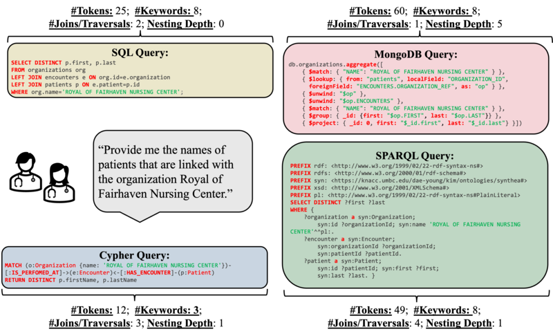

# SM3-Text-to-Query: <ins>S</ins>ynthetic <ins>M</ins>ulti-<ins>M</ins>odel <ins>M</ins>edical Text-to-Query Benchmark





This repository contains both the data and code for:

**SM3-Text-to-Query: Synthetic Multi-Model Medical Text-to-Query Benchmark**   
Authors: Sithursan Sivasubramaniam, Cedric Osei-Akoto, Yi Zhang, Kurt Stockinger, Jonathan Fürst   
**Contact: jonathan.fuerst@zhaw.ch**

[**Paper arXiv Link**](https://arxiv.org/abs/2411.05521)


This work will be presented at [NeurIPS 2024](https://neurips.cc/virtual/2024/poster/97708).
**Please cite our work if you use our data or code.**

```
@misc{sivasubramaniam2024sm3texttoquerysyntheticmultimodelmedical,
      title={SM3-Text-to-Query: Synthetic Multi-Model Medical Text-to-Query Benchmark}, 
      author={Sithursan Sivasubramaniam and Cedric Osei-Akoto and Yi Zhang and Kurt Stockinger and Jonathan Fuerst},
      year={2024},
      eprint={2411.05521},
      archivePrefix={arXiv},
      primaryClass={cs.DB},
      url={https://arxiv.org/abs/2411.05521}, 
}
```

**Note: This repository will be updated further during the next week to make it easier to set up and use the four different databases.**

## Data

The `./data` directory contains our template questions, the Synthea data, train and dev data, and the Text-to-Query results of our evaluated LLMs for all databases.

For detailed information about the data presented in this project, please refer to the README in the `./data` directory. 

## Code

The `./src` directory contains the code to reproduce the results presented in SM3-Text-to-Query.

A more elaborate description of the code components can be found in the README of the `./src` directory.


## Croissant Metadata

```json
{
  "@context": {
    "@language": "en",
    "@vocab": "https://schema.org/",
    "citeAs": "cr:citeAs",
    "column": "cr:column",
    "conformsTo": "dct:conformsTo",
    "cr": "http://mlcommons.org/croissant/",
    "rai": "http://mlcommons.org/croissant/RAI/",
    "data": {
      "@id": "cr:data",
      "@type": "@json"
    },
    "dataType": {
      "@id": "cr:dataType",
      "@type": "@vocab"
    },
    "dct": "http://purl.org/dc/terms/",
    "examples": {
      "@id": "cr:examples",
      "@type": "@json"
    },
    "extract": "cr:extract",
    "field": "cr:field",
    "fileProperty": "cr:fileProperty",
    "fileObject": "cr:fileObject",
    "fileSet": "cr:fileSet",
    "format": "cr:format",
    "includes": "cr:includes",
    "isLiveDataset": "cr:isLiveDataset",
    "jsonPath": "cr:jsonPath",
    "key": "cr:key",
    "md5": "cr:md5",
    "parentField": "cr:parentField",
    "path": "cr:path",
    "recordSet": "cr:recordSet",
    "references": "cr:references",
    "regex": "cr:regex",
    "repeated": "cr:repeated",
    "replace": "cr:replace",
    "sc": "https://schema.org/",
    "separator": "cr:separator",
    "source": "cr:source",
    "subField": "cr:subField",
    "transform": "cr:transform"
  },
  "@type": "sc:Dataset",
  "name": "SM3-Text-to-Query",
  "description": "This dataset contains examples of text-to-query mappings for multiple query languages including SQL, SPARQL, MQL, and Cypher. It includes question type and class information.",
  "conformsTo": "http://mlcommons.org/croissant/1.0",
  "citeAs": "SM3-Text-to-Query Dataset",
  "url": "https://github.com/jf87/SM3-Text-to-Query",
  "distribution": [
    {
      "@type": "cr:FileObject",
      "@id": "github-repository",
      "name": "github-repository",
      "description": "Repository hosting the SM3-Text-to-Query dataset.",
      "contentUrl": "https://github.com/jf87/SM3-Text-to-Query",
      "encodingFormat": "git+https",
      "sha256": "main"
    },
    {
      "@type": "cr:FileSet",
      "@id": "csv-files",
      "name": "csv-files",
      "description": "CSV files hosted in the GitHub repository.",
      "containedIn": {
        "@id": "github-repository"
      },
      "encodingFormat": "text/csv",
      "includes": "data/train_dev/*.csv"
    }
  ],
  "recordSet": [
    {
      "@type": "cr:RecordSet",
      "@id": "csv",
      "name": "csv",
      "field": [
        {
          "@type": "cr:Field",
          "@id": "csv/question",
          "name": "question",
          "description": "The natural language question.",
          "dataType": "sc:Text",
          "source": {
            "fileSet": {
              "@id": "csv-files"
            },
            "extract": {
              "column": "question"
            }
          }
        },
        {
          "@type": "cr:Field",
          "@id": "csv/sql",
          "name": "sql",
          "description": "The SQL query.",
          "dataType": "sc:Text",
          "source": {
            "fileSet": {
              "@id": "csv-files"
            },
            "extract": {
              "column": "sql"
            }
          }
        },
        {
          "@type": "cr:Field",
          "@id": "csv/sparql",
          "name": "sparql",
          "description": "The SPARQL query.",
          "dataType": "sc:Text",
          "source": {
            "fileSet": {
              "@id": "csv-files"
            },
            "extract": {
              "column": "sparql"
            }
          }
        },
        {
          "@type": "cr:Field",
          "@id": "csv/mql",
          "name": "mql",
          "description": "The MQL query.",
          "dataType": "sc:Text",
          "source": {
            "fileSet": {
              "@id": "csv-files"
            },
            "extract": {
              "column": "mql"
            }
          }
        },
        {
          "@type": "cr:Field",
          "@id": "csv/cypher",
          "name": "cypher",
          "description": "The Cypher query.",
          "dataType": "sc:Text",
          "source": {
            "fileSet": {
              "@id": "csv-files"
            },
            "extract": {
              "column": "cypher"
            }
          }
        },
        {
          "@type": "cr:Field",
          "@id": "csv/question_type",
          "name": "question_type",
          "description": "The type of the question.",
          "dataType": "sc:Text",
          "source": {
            "fileSet": {
              "@id": "csv-files"
            },
            "extract": {
              "column": "question_type"
            }
          }
        },
        {
          "@type": "cr:Field",
          "@id": "csv/class",
          "name": "class",
          "description": "The class of the query or question.",
          "dataType": "sc:Text",
          "source": {
            "fileSet": {
              "@id": "csv-files"
            },
            "extract": {
              "column": "class"
            }
          }
        }
      ]
    }
  ]
}
```
