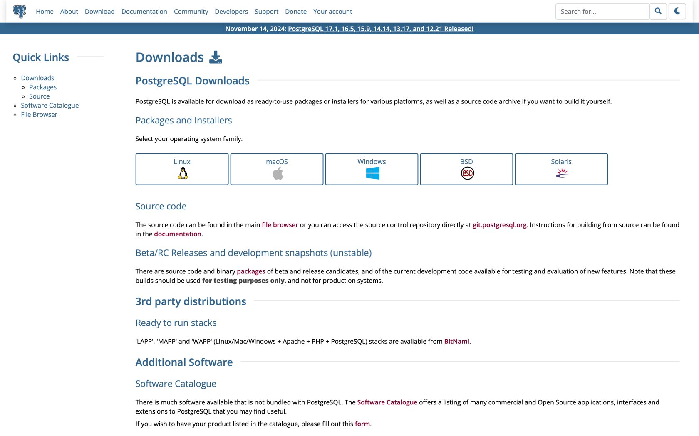
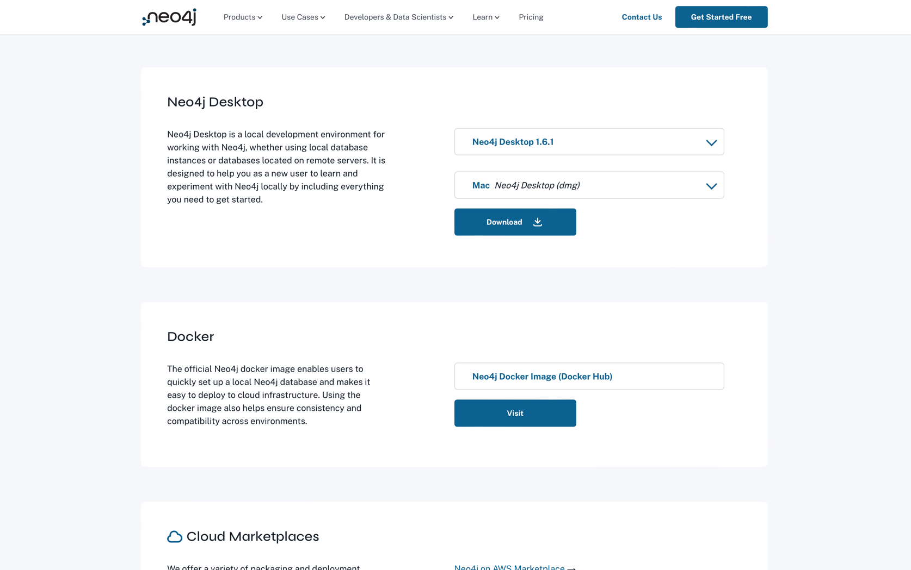
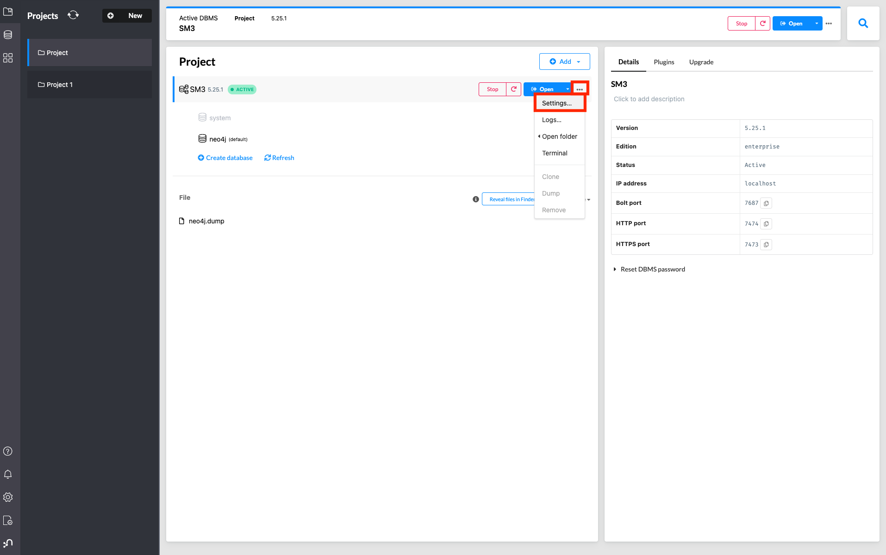
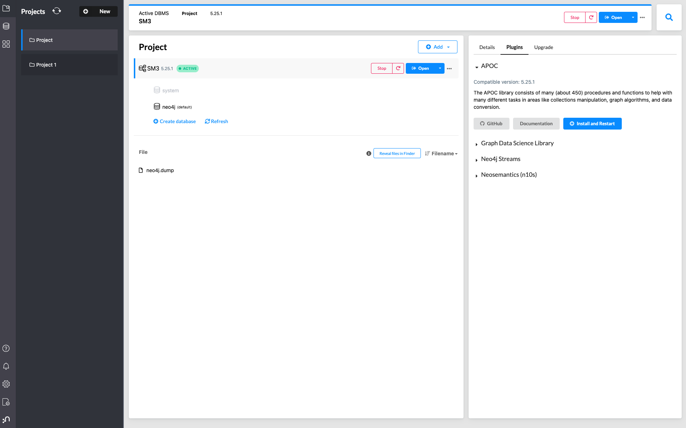
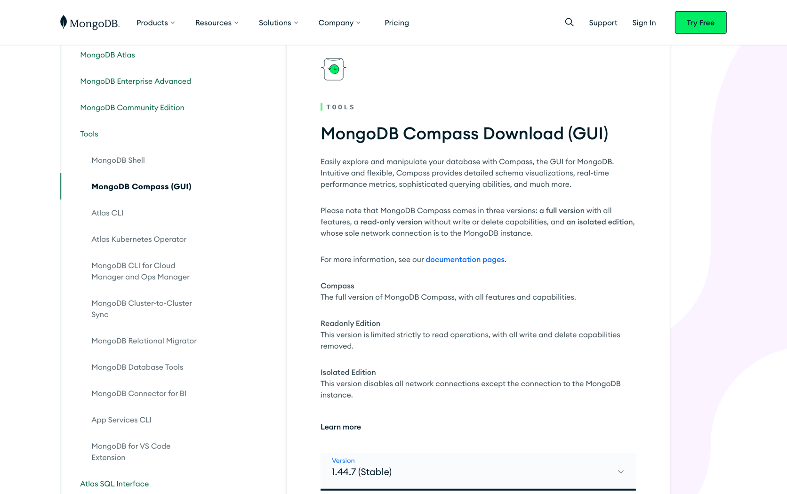

# Database Setup Instructions

SM3-Text-to-Query contains four database systems: PostgreSQL, Neo4j, Graph, and MongoDB. The following instructions will guide you through setting up each of these databases.
Use the provided `environment.yml` file to ensure the appropriate dependencies are installed.


**Note: These instructions will be heavily updated and improved during the next couple of weeks.**

## Setting up Virtual environment with project dependencies 

1. **Install miniconda**
   - Install miniconda for your system based on the official documentation [here.](https://docs.anaconda.com/miniconda/)
2. **Creating virtual environment**
   - Run the following command to create virtual environment based on project specifications
     
     ```conda env create -f ./src/environment.yml```
     
     ```conda activate sm3```

--------------------------------------------------------------------------------------------------------------------------------------------------------------
# PostgreSQL DB Instructions

## Prerequisites
### Installation of PostgreSQL
Install PostgreSQL for your system according to the instructions provided [here](https://www.postgresql.org/download/).


## Steps to Ingest Synthea Data in PostgreSQL
### Ingestion with custom file:
1. Run the `./postgres/setup-postgres.py` script with the appropriate parameters.
- Using SM3 Synthea data:

Run the `./postgres/setup-postgres.py` file without further configuration. 

- Using custom Synthea data: 

Replace the Synthea csv data in the `../../data/synthea_data` folder.

Run the `./postgres/setup-postgres.py` file without further configuration. 

--------------------------------------------------------------------------------------------------------------------------------------------------------------
# Neo4j DB Instructions

## Prerequisites
### Installation of Neo4j Desktop
1. Install Neo4j Desktop for your system according to the instructions provided [here](https://neo4j.com/deployment-center/?desktop-gdb).


2. Open Neo4j Desktop Create a new Project.
3. Add Local DBMS system to project

4. Create DBMS system 
- Name:SM3 
- Password: password
5. Update Settings File
- Add the following lines: to the settings file: 

server.memory.heap.initial_size=1G

server.memory.heap.max_size=4G

server.memory.pagecache.size=2G

dbms.memory.transaction.total.max=5G

- Press Apply and then close settings


6. Install APOC plugin
- Change to the Plugin Tab of the database
- Install and Restart the Neo4j database with the button "Install and Restart"


## Steps to Ingest Synthea Data in Neo4j
### Ingestion with custom file: 
1. Run the `./neo4j/ingest.py` script with the appropriate parameters.
- Using SM3 Synthea data:

Run the `./neo4j/ingest.py` file without further configuration.

- Using custom Synthea data:

Replace the Synthea csv data in the `../../data/synthea_data` folder.
Run the `./neo4j/ingest.py` file without further configuration.
--------------------------------------------------------------------------------------------------------------------------------------------------------------
# Graph DB Instructions
## Prerequisites
### Installation of GraphDB
1. Install GraphDB Desktop for your system according to the instructions provided [here](https://graphdb.ontotext.com/documentation/10.7/graphdb-desktop-installation.html)

### Steps to Ingest Synthea Data in GraphDB 
1. **Conversion of Synthea CSV files to TTL files**\
In order for the Synthea CSV data to be inserted into the GrapgDB database the files have to be converted into a compatible format.
This is done by following the command below.
- Run the `./graphdb/synthea-rdf-converter-fork/conversion.py` file.
2. **Upload of Synthea TLL files to GraphDB database**
- Run the `./graphdb/setup-graphdb.py` file.

####Alert: THESE FACTS NEED TO BE TAKEN INTO CONSIDERATION COMPUTING Extract transform and Load for GraphDB 
- GraphDB needs a large amount of disk space to both convert and upload data for the experiments (>10GB) 
- GraphDB query execution time is slow due to there being a large amount of single entities!

--------------------------------------------------------------------------------------------------------------------------------------------------------------
# MongoDB Instructions

## Prerequisites
### Installation of MongoDB
1. Install MongoDB for your system according to the instructions provided [here](https://www.mongodb.com/try/download/compass).


2. Connect to the mongodb database

## Steps to Ingest Synthea Data in MongoDB
### Ingestion with custom file:
1. Run the `./mongodb/setup-mongodb.py` file without further configuration. 
- Using SM3 Synthea data:

Run the `./mongodb/setup-mongodb.py` file without further configuration.

- Using custom Synthea data:

Replace the Synthea csv data in the `../../data/synthea_data` folder.
Run the `./mongodb/setup-mongodb.py` file without further configuration.
--------------------------------------------------------------------------------------------------------------------------------------------------------------
